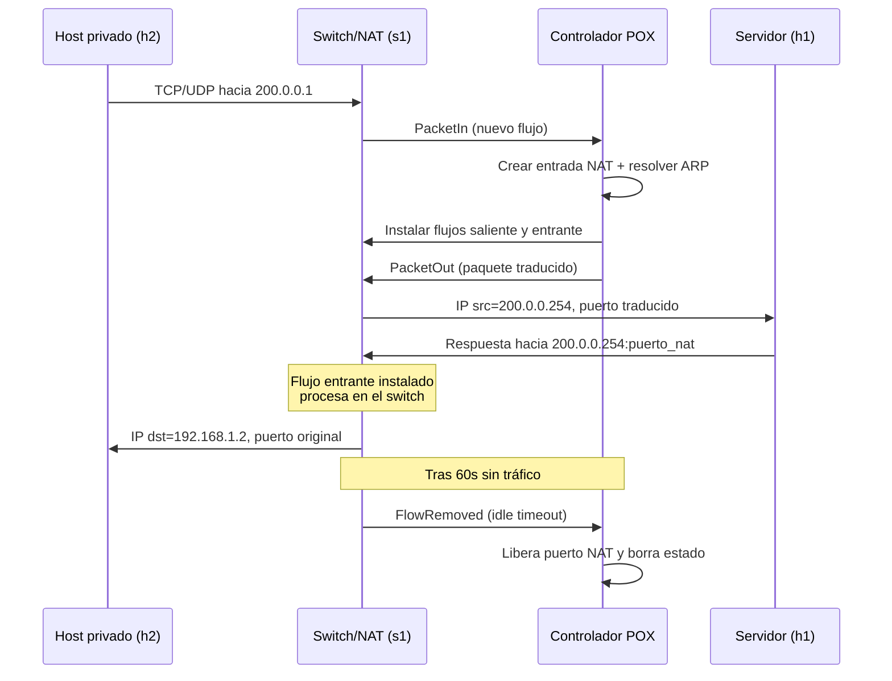

# Trabajo Práctico N° 2: SDN — NAT

**Materia:** Redes (TA048) / Introducción a los Sistemas Distribuidos (75.43)  
**Facultad de Ingeniería, Universidad de Buenos Aires**  
**Fecha de entrega:** Martes 23 de Junio de 2026, 19:00 hs.

---

## Índice

1. [Descripción general de la solución](#1-descripción-general-de-la-solución)
2. [Diseño de la tabla NAT](#2-diseño-de-la-tabla-nat)
3. [Manejo de ARP](#3-manejo-de-arp)
4. [Estrategia de instalación de flujos](#4-estrategia-de-instalación-de-flujos)
5. [Decisiones de diseño](#5-decisiones-de-diseño)
6. [Problemas encontrados y soluciones implementadas](#6-problemas-encontrados-y-soluciones-implementadas)
7. [Pruebas realizadas](#7-pruebas-realizadas)
8. [Estado de cumplimiento de requisitos](#8-estado-de-cumplimiento-de-requisitos)
9. [Conclusión](#9-conclusión)

---

## 1. Descripción general de la solución

El objetivo del trabajo es implementar un **NAT saliente con traducción por puertos (PAT)** sobre una red SDN emulada con **Mininet**, controlada por **POX** mediante OpenFlow 1.0.

La solución extiende el controlador base `protorouter.py` y la topología `topo.py` provistos por la cátedra. El switch OpenFlow (`s1`) actúa como dispositivo de capa 3 con dos interfaces lógicas:

| Interfaz   | IP             | MAC               | Puerto del switch |
|------------|----------------|-------------------|-------------------|
| Pública    | 200.0.0.254    | 00:00:00:aa:aa:aa | 1                 |
| Privada    | 192.168.1.254  | 00:00:00:bb:bb:bb | 2, 3, …           |

### Topología implementada

```
                    Red Pública                         Red Privada
                       port 1                              port 2, 3
    ┌───────┐     IP: 200.0.0.254              IP: 192.168.1.254     ┌───────┐
    │  h1   ├──────────────────── s1 ──────────────────────────────── │  h2   │
    └───────┘                                                         └───────┘
 200.0.0.1/24                                                      192.168.1.2/24
 DG: 200.0.0.254                                                   DG: 192.168.1.254
                                                                     ┌───────┐
                                                                     │  h3   │
                                                                     └───────┘
                                                                 192.168.1.3/24
```

- **h1:** servidor en la red pública (`200.0.0.1/24`).
- **h2, h3:** clientes en la red privada (`192.168.1.2/24`, `192.168.1.3/24`).

### Flujo de paquetes



El controlador implementa la lógica de traducción, mantiene el estado de conexiones e instala reglas OpenFlow para que el tráfico posterior sea procesado en el switch sin intervención del controlador.

### ¿Qué es `pox/` y qué tocamos?

| Carpeta | Qué es | ¿Se modifica? |
|---------|--------|---------------|
| `pox/pox/` | Código interno del controlador POX (librería) | **No** |
| `pox/ext/` | Donde POX carga **nuestra** aplicación | Solo se **copia** `protorouter.py` al ejecutar (el PDF §5.3 lo pide) |
| `tp_sdn_nat/` | **Todo el trabajo del TP** | **Sí** |

El enunciado dice explícitamente:

> *El archivo del controlador provisto (protorouter.py) debe ubicarse en el directorio `pox/ext/`*

Eso no es modificar la librería: es instalar nuestro script en el lugar desde donde POX lo ejecuta. El script fuente vive en `tp_sdn_nat/`; `run_pox.sh` lo copia antes de arrancar.

### Archivos del TP

| Archivo | Descripción |
|---------|-------------|
| `tp_sdn_nat/protorouter.py` | Controlador NAT/PAT + ARP |
| `tp_sdn_nat/topo.py` | Topología Mininet (h1 público, h2/h3 privados) |
| `tp_sdn_nat/run_pox.sh` | Copia el controlador a `pox/ext/` y arranca POX |

---

## 2. Diseño de la tabla NAT

El NAT mantiene **tres estructuras de estado** en memoria del controlador:

### Tabla saliente (`nat_out`)

Mapea conexiones originadas en la red privada hacia un puerto público asignado.

```
Clave:  (protocolo, IP_privada, puerto_privado)
Valor:  {
          pub_port, cookie, in_port,
          dst_ip, dst_port, priv_ip, priv_port, proto
        }
```

**Ejemplo:**

| Protocolo | IP privada   | Puerto privado | IP pública    | Puerto público | Cookie |
|-----------|--------------|----------------|---------------|----------------|--------|
| TCP (6)   | 192.168.1.2  | 45678          | 200.0.0.254   | 10000          | 1      |
| TCP (6)   | 192.168.1.3  | 45678          | 200.0.0.254   | 10001          | 2      |
| UDP (17)  | 192.168.1.2  | 5353           | 200.0.0.254   | 10002          | 3      |

### Tabla entrante (`nat_in`)

Permite identificar el host privado destino a partir del puerto público en las respuestas.

```
Clave:  (protocolo, puerto_público)
Valor:  (IP_privada, puerto_privado, puerto_switch_privado)
```

### Mapa cookie → NAT (`cookie_to_nat`)

Asocia el cookie OpenFlow de los flujos instalados con la clave NAT, para limpiar el estado al expirar.

```
cookie -> (protocolo, IP_privada, puerto_privado)
```

### Pool de puertos (`free_ports`)

Conjunto de puertos públicos liberados al expirar conexiones. `_alloc_port()` reutiliza del pool antes de incrementar `next_port`.

### Asignación y liberación de puertos

1. **Asignación:** se toma primero de `free_ports` (menor puerto disponible); si está vacío, se usa `next_port` y se incrementa.
2. **Liberación:** al expirar un flujo (`FlowRemoved` por `idle_timeout`), el puerto vuelve a `free_ports`.
3. **Colisiones:** las claves `(protocolo, IP, puerto)` evitan conflictos entre conexiones distintas.

### Traducción por protocolo

| Protocolo | Campo identificador | Traducción saliente | Traducción entrante |
|-----------|---------------------|---------------------|---------------------|
| TCP       | `srcport` / `dstport` | IP src → pública, puerto src → asignado | IP dst → privada, puerto dst → original |
| UDP       | `srcport` / `dstport` | Idem TCP | Idem TCP |
| ICMP echo | `echo.id`           | IP src → pública, `id` → puerto NAT | IP dst → privada, `id` → original |

> **Nota:** El soporte ICMP (ping) está implementado como extensión opcional, usando el campo `id` del echo request/reply como identificador de “puerto”.

---

## 3. Manejo de ARP

### Tabla ARP dinámica

```
arp_table: IP → (MAC, puerto_del_switch)
```

Se actualiza en cada ARP request/reply recibido y también al observar tráfico IP de hosts privados.

### ARP Requests — respuestas del NAT

Cuando un host pregunta por las IPs del dispositivo NAT, el controlador responde directamente:

| IP consultada   | MAC de respuesta    |
|-----------------|---------------------|
| 200.0.0.254     | 00:00:00:aa:aa:aa   |
| 192.168.1.254   | 00:00:00:bb:bb:bb   |

### ARP Requests — resolución de hosts

Para tráfico saliente hacia la red pública, si la MAC del destino no está en la tabla:

1. El paquete se **encola** en `pending[IP_destino]`.
2. Se envía un **ARP request broadcast** desde la interfaz pública (`PUBLIC_IP`, `PUBLIC_MAC`, puerto 1).
3. Al recibir el **ARP reply**, se procesan los paquetes pendientes con `_flush_pending()`.

### Sin ARP estático

La topología (`topo.py`) **no configura entradas ARP estáticas** en ningún host. Toda resolución es dinámica, cumpliendo el requisito del enunciado.

### Cambio de IP/MAC (demo)

- **Hosts (h1, h2, h3):** editar `topo.py`. Sus MACs las aprende el controlador por ARP; no están hardcodeadas en la lógica.
- **IPs/MACs del NAT:** editar constantes al inicio de `protorouter.py` y los gateways en `topo.py`. Ejecutar `./tp_sdn_nat/run_pox.sh` para copiar el controlador actualizado a `pox/ext/`.

---

## 4. Estrategia de instalación de flujos

El controlador instala **dos reglas OpenFlow por cada nueva conexión**, con:

- `idle_timeout = 60` segundos
- `OFPFF_SEND_FLOW_REM` — el switch notifica al controlador cuando el flujo expira
- `cookie` compartido entre flujo saliente y entrante — identifica la entrada NAT

### Flujo saliente (privada → pública)

**Match:**

- `dl_type = 0x0800` (IPv4)
- `nw_proto` = TCP/UDP/ICMP
- `nw_src` = IP del host privado
- `nw_dst` = IP del destino público
- `in_port` = puerto del switch donde está el host privado
- `tp_src` / `tp_dst` (TCP/UDP) o sin puertos (ICMP)

**Acciones:**

1. `set_nw_src` → `200.0.0.254`
2. `set_tp_src` → puerto NAT asignado (TCP/UDP)
3. `set_dl_src` → MAC pública del NAT
4. `set_dl_dst` → MAC del destino (de tabla ARP)
5. `output` → puerto 1 (red pública)

### Flujo entrante (pública → privada)

**Match:**

- `dl_type = 0x0800`
- `nw_proto` = protocolo
- `nw_src` = IP del servidor público (cuando se conoce)
- `nw_dst` = `200.0.0.254`
- `tp_src` / `tp_dst` = puertos del servidor y NAT (TCP/UDP)
- `in_port` = 1

**Acciones:**

1. `set_nw_dst` → IP privada del cliente
2. `set_tp_dst` → puerto privado original
3. `set_dl_src` → MAC privada del NAT
4. `set_dl_dst` → MAC del cliente privado
5. `output` → puerto del switch donde está el host

### Expiración y limpieza (`_handle_FlowRemoved`)

Cuando un flujo expira por inactividad (`idle_timeout`):

1. El switch envía `FlowRemoved` al controlador.
2. El controlador identifica la entrada NAT por `cookie`.
3. Se eliminan `nat_out`, `nat_in` y `cookie_to_nat`.
4. Se envían `flow_mod DELETE` para el flujo parejo (evita reglas huérfanas).
5. El puerto público vuelve al pool `free_ports`.

### Minimización de intervención del controlador

| Evento | Interviene el controlador |
|--------|---------------------------|
| Primer paquete de un flujo nuevo | Sí — crea entrada NAT, resuelve ARP, instala flujos |
| Paquetes subsiguientes del mismo flujo | No — los procesa el switch |
| ARP request/reply | Sí |
| Expiración de flujo por inactividad | Sí — solo para limpiar estado NAT (no procesa datos) |
| Tráfico rutinario ya establecido | No — el switch traduce y reenvía sin latencia de controlador |

El primer paquete de cada dirección se reenvía con `PacketOut` además de instalar el flujo correspondiente. No se loguea cada paquete IP para reducir overhead en el controlador.

---

## 5. Decisiones de diseño

1. **PAT en el controlador, forwarding en el switch.** La traducción se define en POX; una vez instaladas las reglas, el datapath hace el trabajo pesado.

2. **Dos tablas (`nat_out` / `nat_in`) + mapa de cookies.** Separar la búsqueda saliente de la entrante y usar cookies OpenFlow permite limpiar estado al expirar flujos de forma idempotente.

3. **Pool de puertos reutilizables (`free_ports`).** Cumple el requisito de reutilizar recursos cuando las conexiones expiran, sincronizado con el `idle_timeout` de los flujos.

4. **Identificación por tupla (protocolo, IP, puerto).** Permite que dos hosts privados usen el mismo puerto origen hacia el mismo destino sin conflicto.

5. **Cola de paquetes pendientes (`pending`).** Evita perder el primer paquete de una conexión mientras se resuelve ARP.

6. **Aprendizaje de MAC privada desde el paquete.** Si un host privado envía tráfico sin haber hecho ARP previo al NAT, se aprende su MAC del campo `eth.src`.

7. **Constantes del NAT en `protorouter.py`.** IPs/MACs del dispositivo NAT al inicio del archivo; hosts aprendidos dinámicamente.

8. **Eliminación de flujos parejos al expirar.** Evita que reglas huérfanas en el switch causen colisiones al reutilizar puertos NAT.

9. **Soporte ICMP opcional.** Se usa `echo.id` como pseudo-puerto para permitir ping a través del NAT.

10. **IPv6 deshabilitado en la topología.** Se desactiva en hosts y switch para evitar tráfico fuera del alcance del NAT implementado.

---

## 6. Problemas encontrados y soluciones implementadas

| Problema | Solución aplicada |
|----------|-------------------|
| El controlador base no resolvía ARP | Implementación completa de ARP proxy + resolución dinámica de hosts |
| Un solo host privado en la topología original | Se agregaron h2 y h3 en `topo.py` |
| Primer paquete perdido si ARP del destino no estaba resuelto | Cola `pending` + reenvío al recibir ARP reply |
| Respuestas entrantes sin flujo instalado | Flujo entrante instalado desde `_process_outbound()` y `_handle_inbound()` |
| Match de flujos demasiado amplio | Campos `nw_dst`, `tp_dst`, `in_port` (saliente) y `nw_src`, `tp_src` (entrante) |
| Checksums incorrectos tras traducción | Se ponen en 0 (`csum = 0`) para que el endpoint los recalcule |
| Puertos NAT no se reutilizaban al expirar conexiones | Handler `_handle_FlowRemoved` + pool `free_ports` + `OFPFF_SEND_FLOW_REM` |
| Estado NAT zombie tras expiración de flujos | Limpieza de `nat_out`/`nat_in` sincronizada con timeout del switch |
| Reglas huérfanas en el switch | `_delete_nat_flows()` elimina el flujo parejo al expirar |
| Copias desincronizadas del controlador | `tp_sdn_nat/protorouter.py` alineado con `pox/ext/` |
| Hardcodeo de hosts en controlador | Hosts aprendidos por ARP; solo constantes del NAT en `protorouter.py` |
| Log excesivo por paquete IP | Eliminado log rutinario; solo eventos relevantes |

---

## 7. Guía de pruebas

### 7.1. Requisitos previos

- Python 3, Mininet y POX instalados.
- Ejecutar siempre desde la **raíz del repositorio** (`tp2-sdn-nat/`).

### 7.2. Puesta en marcha

**Terminal 1 — Controlador POX:**

```bash
cd tp2-sdn-nat
./tp_sdn_nat/run_pox.sh log.level --DEBUG protorouter
```

Esperar el mensaje `ProtoRouter (NAT/PAT) iniciado` y la conexión del switch.

**Terminal 2 — Topología Mininet:**

```bash
cd tp2-sdn-nat
sudo python3 tp_sdn_nat/topo.py
```

**Orden obligatorio:** 1) POX, 2) Mininet.

### 7.3. Prueba 1 — Conectividad básica (ICMP)

```bash
mininet> h2 ping -c 3 h1
mininet> h3 ping -c 3 h1
```

**Verificar en logs de POX:**
- `ARP aprendido` para h1 y hosts privados.
- `Nueva entrada NAT: 192.168.1.x:... → 200.0.0.254:10000`.
- `SALIENTE` / `ENTRANTE` en el primer paquete; luego el switch procesa solo.

**Verificar en Mininet:** `0% packet loss`.

### 7.4. Prueba 2 — Múltiples clientes simultáneos

```bash
mininet> h2 ping -c 10 h1 &
mininet> h3 ping -c 10 h1 &
mininet> jobs
```

**Verificar:** cada host recibe puerto NAT distinto (10000, 10001, …) y ping llega al host correcto sin cruce.

### 7.5. Prueba 3 — Tráfico TCP

En h1, levantar un servidor TCP:

```bash
mininet> h1 python3 -m http.server 8080 &
```

Desde h2:

```bash
mininet> h2 curl -s --connect-timeout 5 http://200.0.0.1:8080/ | head
```

**Verificar:** respuesta HTTP; en POX aparece entrada NAT con protocolo TCP (6).

### 7.6. Prueba 4 — Tráfico UDP

Terminal en h1:

```bash
mininet> h1 nc -u -l 9999 &
```

Desde h2:

```bash
mininet> h2 bash -c 'echo hola | nc -u -w1 200.0.0.1 9999'
```

**Verificar:** mensaje recibido en h1; entrada NAT UDP en POX.

### 7.7. Prueba 5 — Reutilización de puertos NAT

```bash
mininet> h2 ping -c 1 h1
```

Esperar **más de 60 segundos** sin generar tráfico.

```bash
mininet> h2 ping -c 1 h1
```

**Verificar en logs de POX:**

```
FlowRemoved (idle, cookie=...) → limpiando NAT ...
Puerto NAT 10000 liberado (pool: 1 libres)
Nueva entrada NAT: ... → 200.0.0.254:10000 (cookie=...)
```

El puerto 10000 se reutiliza del pool.

### 7.8. Prueba 6 — Minimización del controlador

Con una conexión activa (ping continuo o `curl`):

```bash
mininet> h2 ping h1
```

Observar logs de POX: tras el **primer** paquete de cada flujo, no deben aparecer más `SALIENTE`/`ENTRANTE` mientras el flujo esté activo (< 60 s entre paquetes). El switch procesa el resto.

Opcional — contar PacketIn con tcpdump en el puerto OpenFlow o revisar que los logs quedan quietos durante tráfico sostenido.

### 7.9. Prueba 7 — Cambio de IP y MAC (demo)

1. En `topo.py`, cambiar por ejemplo h2:

```python
ip='192.168.1.50/24', mac='00:00:00:00:00:99'
```

2. Si cambian las IPs del NAT, actualizar también las constantes en `protorouter.py` y los `defaultRoute` en `topo.py`.

3. Reiniciar POX con `./tp_sdn_nat/run_pox.sh` y Mininet.

4. Probar: `h2 ping -c 3 h1`

### 7.10. Prueba 8 — Sin ARP estático

```bash
mininet> h2 arp -d *
mininet> h1 arp -d *
mininet> h2 ping -c 2 h1
```

**Verificar:** funciona igual; las tablas ARP se reconstruyen por ARP dinámico del controlador.

### 7.11. Herramientas opcionales de diagnóstico

| Herramienta | Uso |
|-------------|-----|
| `tcpdump -i s1-eth1 -n` | Ver tráfico en interfaz pública del switch |
| `tcpdump -i s1-eth2 -n` | Ver tráfico en interfaz privada |
| Wireshark | Captura y análisis de traducción IP/puerto |
| `iperf3 -s` en h1 / `iperf3 -c` en h2 | Throughput TCP/UDP simultáneo |

### 7.12. Solución de problemas

| Síntoma | Causa probable | Acción |
|---------|----------------|--------|
| Switch no conecta a POX | POX no estaba corriendo | Iniciar POX antes que Mininet |
| `network_config.py not found` | POX ejecutado fuera del repo | Ejecutar desde raíz del proyecto |
| Ping falla tras cambiar IPs | No se reinició POX/Mininet | Reiniciar ambos tras editar config |
| `ENTRANTE sin entrada NAT` | Flujo expiró y puerto reasignado a otro host | Normal si hay colisión; esperar y reintentar |
| Sin puertos NAT disponibles | Pool agotado sin liberación | Verificar que FlowRemoved aparece en logs |

---

## 8. Estado de cumplimiento de requisitos

### Requisitos funcionales (§4.3 del enunciado)

| Requisito | Estado | Observaciones |
|-----------|--------|---------------|
| Comunicación desde múltiples hosts privados | ✅ Implementado | h2 y h3 en topología |
| Soporte TCP y UDP | ✅ Implementado | Inspección de headers de transporte |
| ARP dinámico | ✅ Implementado | Sin entradas estáticas |
| Mantener estado de conexiones activas | ✅ Implementado | Tablas `nat_out` / `nat_in` |
| Traducción correcta en ambos sentidos | ✅ Implementado | Flujos saliente y entrante |

### Tareas del trabajo (§6)

| Tarea | Estado | Observaciones |
|-------|--------|---------------|
| 6.1 Extensión de topología | ✅ Hecho | h2, h3 agregados; sin ARP estático |
| 6.2 Manejo de ARP | ✅ Hecho | Proxy, requests, tabla dinámica |
| 6.3 NAT por puertos (PAT) | ✅ Hecho | Traducción, pool de puertos, reutilización |
| 6.4 Instalación de flujos | ✅ Hecho | Flujos bidireccionales, timeout, FlowRemoved |

### Entregables (§7.1)

| Entregable | Estado | Observaciones |
|------------|--------|---------------|
| Script de topología actualizado | ✅ Hecho | `tp_sdn_nat/topo.py` |
| Controlador POX modificado | ✅ Hecho | `pox/ext/protorouter.py` |
| Informe (PDF) | ⚠️ Pendiente | Este documento en Markdown; falta exportar a PDF para campus |

### Demostración oral (§7.3)

| Requisito de demo | Estado |
|-------------------|--------|
| Modificar IP/MAC en topología sin depender de hardcoding | ✅ Implementado — editar `network_config.py` |
| Pruebas con múltiples conexiones simultáneas | ✅ Implementado — ver guía §7.4 |
| Explicar funcionamiento interno del controlador | ✅ Documentado en este informe |

### Elementos pendientes (fuera de implementación)

1. **Informe en PDF.** Exportar este Markdown a PDF para entrega en campus.

2. **Capturas de pantalla / logs exportados.** Opcional para adjuntar evidencia de las pruebas de §7.

---

## 9. Conclusión

Se implementó un NAT saliente con PAT sobre SDN utilizando POX y Mininet, cumpliendo todos los requisitos funcionales del enunciado:

- Extensión de topología con múltiples hosts privados.
- Resolución ARP dinámica sin entradas estáticas.
- Traducción TCP/UDP (e ICMP opcional) en ambos sentidos.
- Instalación de flujos OpenFlow con mínima intervención del controlador.
- Reutilización de puertos NAT sincronizada con `FlowRemoved`.
- Configuración mínima: constantes del NAT en `protorouter.py`, hosts en `topo.py`.

**Pendiente solo para entrega administrativa:** exportar este informe a PDF.

---

## Apéndice: estructura del repositorio

```
tp2-sdn-nat/
├── pox/                            # Controlador POX (dependencia externa, NO modificar pox/pox/)
│   └── ext/                        # POX carga protorouter.py desde aquí al ejecutar
├── INFORME.md
└── tp_sdn_nat/                     # TODO el trabajo del TP
    ├── protorouter.py              # Controlador NAT/PAT
    ├── topo.py                     # Topología Mininet
    ├── run_pox.sh                  # Copia protorouter → pox/ext/ y arranca POX
    └── README.md
```
